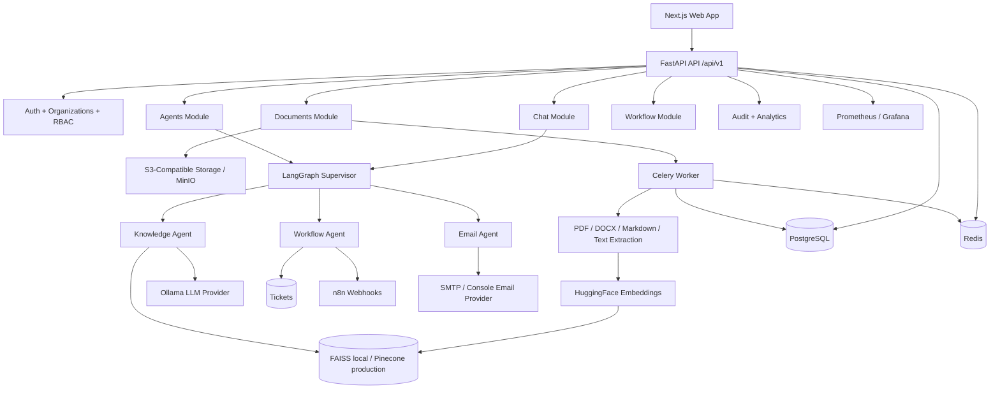

# AegisAI

**Enterprise AI operations and knowledge intelligence platform.**

AegisAI is an open-source platform for turning private company knowledge into governed AI workflows. It combines multi-tenant document management, retrieval-augmented generation, LangGraph agents, workflow automation, audit logging, and production-ready observability in one full-stack monorepo.

[](https://www.python.org/)
[](https://fastapi.tiangolo.com/)
[](https://nextjs.org/)
[](https://www.typescriptlang.org/)
[](https://langchain-ai.github.io/langgraph/)
[](https://www.langchain.com/)
[](https://www.docker.com/)
[](https://www.postgresql.org/)
[](https://redis.io/)
[](.github/workflows/ci.yml)
[](#license)

---

## Overview

Most enterprises already have the knowledge they need to move faster. The problem is that it is scattered across documents, tickets, inboxes, workflow tools, and tribal memory. Teams spend time searching, copying context between systems, and making decisions without a reliable audit trail.

AegisAI is designed as the AI operations layer for that environment. It ingests internal documents, chunks and embeds knowledge, answers questions with citations, routes requests through specialized AI agents, creates workflow artifacts, and keeps the whole system tenant-scoped, observable, and auditable.

> Built as a modular monolith: simple to run locally, clear to reason about, and structured so modules can be extracted later if scale demands it.

## Why AegisAI?

| Enterprise pain | AegisAI approach |
|---|---|
| Disconnected tools and workflows | Connect document intelligence, chat, tickets, email, and n8n webhooks behind one API. |
| Knowledge silos | Turn uploaded PDFs, DOCX files, Markdown, and text into a searchable organization knowledge base. |
| Manual operational work | Use LangGraph agents to answer questions, draft tickets, and draft or send emails. |
| Weak AI governance | Scope data by organization, enforce RBAC, store structured citations, and write audit logs. |
| Hard-to-operate prototypes | Ship with Docker Compose, Celery workers, Redis, Postgres, MinIO, Prometheus, Grafana, and CI. |

## Key Features

### Identity and Access

- Email/password authentication with access and refresh JWTs.
- Email verification and password reset token flows.
- Multi-tenant organizations with `owner`, `admin`, and `member` roles.
- Organization-scoped authorization guards across documents, chat, workflows, analytics, and audit logs.

### Knowledge Base

- Upload and manage PDF, DOCX, Markdown, and plain-text documents.
- Store original files in an S3-compatible backend, using MinIO locally.
- Version documents immutably so AI citations can point to the exact source version.
- Process files asynchronously through Celery workers.
- Detect scanned PDFs that need OCR instead of silently indexing empty content.

### Retrieval-Augmented Generation

- Extract, chunk, embed, and index document content.
- Use FAISS for local vector search and Pinecone support for production vector storage.
- Answer questions with retrieved context and structured citations.
- Restrict retrieval by organization and optionally by document.

### AI Agents

- LangGraph supervisor routes each request to the right specialized agent.
- Knowledge Agent answers grounded questions over uploaded documents.
- Workflow Agent drafts and creates support tickets from natural-language requests.
- Email Agent drafts email content and sends when a recipient address is present.
- Agent runs are persisted for analytics and operational visibility.

### Workflow Automation

- Ticket CRUD for organization workflows.
- n8n webhook integration for external automation on ticket creation.
- Example n8n workflow included in `workflows/n8n/`.
- SMTP email provider abstraction with a console-safe local fallback.

### Governance and Observability

- Append-only audit logs for API requests, authentication events, chat actions, and agent invocations.
- Owner/admin-only access to organization audit logs.
- Analytics overview for document, chat, ticket, and agent-run activity.
- Prometheus metrics endpoint and starter Grafana dashboard.
- Optional LangSmith tracing, disabled unless explicitly configured.

## Architecture



## Technology Stack

| Layer | Technologies |
|---|---|
| Frontend | Next.js 14, React 18, TypeScript, Tailwind CSS, React Hook Form, Zod, TanStack Query |
| Backend | FastAPI, Python 3.12, SQLAlchemy 2, Alembic, Pydantic v2 |
| AI | LangGraph, LangChain Core, HuggingFace sentence-transformers, Ollama, FAISS, Pinecone |
| Database | PostgreSQL in Docker, SQLite for tests |
| Cache and Jobs | Redis, Celery |
| Storage | S3-compatible storage via boto3, MinIO for local development |
| Workflow | n8n webhook integration, ticket workflow module, SMTP email provider |
| Observability | Prometheus, Grafana, LangSmith tracing hook |
| DevOps | Docker Compose, GitHub Actions |
| Testing | pytest, pytest-asyncio, FastAPI test client, deterministic fake AI providers |


## Project Structure

```text
aegis-ai/
|-- apps/
|   |-- api/              # FastAPI backend, Alembic migrations, tests
|   |-- web/              # Next.js frontend
|   `-- worker/           # Celery worker entrypoint
|-- packages/
|   |-- ai/               # Shared AI core: embeddings, vector stores, LLMs, agents
|   |-- database/         # Reserved for future shared database utilities
|   `-- shared/           # Reserved for future shared types/utilities
|-- docker/               # Docker Compose and Prometheus config
|-- docs/                 # Architecture and design notes
|-- workflows/
|   |-- grafana/          # Starter Grafana dashboard
|   `-- n8n/              # Example n8n workflow
|-- tests/                # Root-level test placeholder
`-- .github/workflows/    # CI pipeline
```

## Core Modules

| Module | Purpose |
|---|---|
| Authentication | Registers users, logs them in, issues JWTs, and manages verification/reset tokens. |
| Organizations | Provides the tenant boundary, memberships, invites, and role enforcement. |
| Documents | Handles uploads, S3-compatible storage, versioning, text extraction, chunking, and indexing. |
| Chat | Stores conversations and messages, runs grounded RAG, and returns structured citations. |
| Agents | Exposes available agents, ad-hoc invocation, supervisor routing, and agent run history. |
| Workflow | Manages tickets and triggers n8n automation when tickets are created. |
| Analytics | Aggregates organization activity counts and a placeholder AI cost estimate. |
| Audit | Records request, auth, chat, and agent events in an append-only audit table. |

## Enterprise Features

| Capability | Current implementation |
|---|---|
| JWT Authentication | Access and refresh tokens signed with `JWT_SECRET_KEY`. |
| RBAC | Organization roles enforced with FastAPI dependency guards. |
| Multi-Tenant Organizations | Tenant data carries `organization_id`; vector search is namespaced or indexed per organization. |
| Audit Logging | Best-effort append-only audit logs with owner/admin access control. |
| Prompt Injection Protection | RAG prompts instruct the model to answer only from retrieved context, and citations are stored separately from model text. Full prompt-injection hardening remains a future security track. |
| PII Handling | Sensitive audit views are role-restricted and secrets are environment-driven. Automated PII detection/redaction is not yet implemented. |
| Versioned APIs | All product routes are mounted under `/api/v1`. |
| Background Workers | Celery processes document extraction, chunking, embedding, and indexing. |
| Docker Deployment | Local stack includes web, API, worker, Postgres, Redis, MinIO, Ollama, n8n, Prometheus, and Grafana. |
| CI | GitHub Actions runs backend tests plus frontend lint/build on pushes and pull requests. |
| Monitoring | `/metrics` exposes Prometheus counters/histograms; Grafana dashboard JSON is included. |

## Running Locally

Docker Compose is the recommended path.

```bash
cp apps/api/.env.example apps/api/.env
# Edit apps/api/.env and set JWT_SECRET_KEY to a long random value.

cd docker
docker compose up --build
```

Services:

| Service | URL |
|---|---|
| Web | http://localhost:3000 |
| API | http://localhost:8000 |
| Swagger | http://localhost:8000/api/docs |
| MinIO Console | http://localhost:9001 |
| n8n | http://localhost:5678 |
| Prometheus | http://localhost:9090 |
| Grafana | http://localhost:3001 |

For local LLM responses, pull a model once the Ollama container is running:

```bash
docker exec -it $(docker compose ps -q ollama) ollama pull llama3
```

## Development Workflow

### Backend

```bash
cd apps/api
python -m venv .venv
source .venv/bin/activate
pip install -e ../../packages/ai
pip install -r requirements.txt
DEBUG=false JWT_SECRET_KEY=test-secret python -m pytest tests/ -q
```

### Frontend

```bash
cd apps/web
npm install
npm run dev
```

### Worker

```bash
cd apps/api
celery -A ../worker/celery_app.celery_app worker --loglevel=info
```

### Database Migrations

```bash
cd apps/api
alembic upgrade head
```

### Testing

```bash
cd apps/api
DEBUG=false JWT_SECRET_KEY=test-secret python -m pytest tests/ -q

cd ../web
npm run lint
npm run build
```

## API

The API is versioned under `/api/v1`. In non-production environments, interactive Swagger documentation is available at:

```text
http://localhost:8000/api/docs
```

The FastAPI app also exposes:

- `GET /health` for health checks.
- `GET /metrics` for Prometheus scraping.

## Documentation

| Topic | Link |
|---|---|
| Architecture | [docs/ARCHITECTURE.md](docs/ARCHITECTURE.md) |
| Database Design | [Architecture: database conventions](docs/ARCHITECTURE.md#database-conventions-enforced-by-mixins-in-appcoremodels_mixins.py) |
| API Reference | [Swagger UI at `/api/docs`](#api) |
| Deployment | [Docker Compose setup](#running-locally) |
| Contributing | [Contributing](#contributing) |

## Roadmap

| Status | Work |
|---|---|
| Completed | Auth, organizations, document processing, RAG chat, LangGraph supervisor, knowledge/workflow/email agents, tickets, n8n integration, email provider, analytics, audit logs, Prometheus metrics, Grafana dashboard, CI. |
| In Progress | Product screenshots, public demo polish, stronger documentation split across `docs/`. |
| Future | OCR execution for scanned PDFs, streaming chat responses, stronger prompt-injection defenses, automated PII detection/redaction, hosted deployment guides, richer workflow builder UX, token-level AI cost metering. |

## Contributing

Contributions are welcome.

1. Fork the repository and create a feature branch.
2. Keep changes scoped to one module or workflow.
3. Add or update tests when behavior changes.
4. Run backend tests and frontend lint/build before opening a pull request.
5. Describe the problem, solution, verification steps, and any follow-up work.

For architecture decisions and module boundaries, start with [docs/ARCHITECTURE.md](docs/ARCHITECTURE.md).

## License

MIT.
